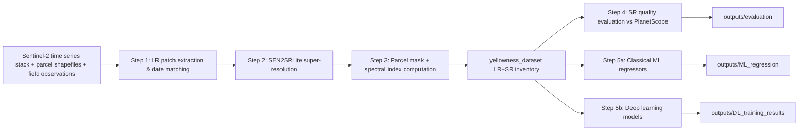

# Sentinel-2 Super-Resolution & Parcel Yellowness Detection

Internship project: a parcel-based Sentinel-2 workflow that (1) builds LR/SR
patch datasets from a multi-temporal Sentinel-2 stack and field observations,
(2) super-resolves Sentinel-2 imagery with SEN2SRLite, (3) evaluates SR
quality against PlanetScope references, and (4) trains classical ML and deep
learning models to predict parcel-level **yellowness** from the resulting
patches.

## Documentation map

| Topic | Document |
|---|---|
| Time-series reading & LR/SR patch extraction (steps followed) | [docs/data_pipeline.md](docs/data_pipeline.md) |
| SR evaluation methodology (steps followed in the evaluation notebook) | [docs/sr_evaluation.md](docs/sr_evaluation.md) |
| ML and DL yellowness-detection methods | [docs/detection_methods.md](docs/detection_methods.md) |
| Deep-learning training protocol (E1-E4 experiments) | [docs/paper_representation_training_protocol.md](docs/paper_representation_training_protocol.md) |
| Deep-learning results analysis (E1-E4 conclusions) | [docs/analyse resultats DL.md](docs/analyse%20resultats%20DL.md) |
| Hardcoded paths to edit before running | [docs/paths_to_update.md](docs/paths_to_update.md) |

## Project workflow (order of operations)



1. **Data pipeline** — read the Sentinel-2 time series, match field
   observations to acquisition dates, extract parcel-centered LR patches,
   run SEN2SRLite super-resolution, rasterize masks, compute spectral
   indices, and write the LR/SR inventory. See
   [docs/data_pipeline.md](docs/data_pipeline.md).
2. **SR evaluation** — compare SR outputs against PlanetScope references
   (alignment, histogram matching, RMSE/MAE/R²/SSIM/SAM, bicubic baseline).
   See [docs/sr_evaluation.md](docs/sr_evaluation.md).
3. **Detection methods** — train classical ML regressors (on tabular
   features or backbone embeddings) and deep-learning CNNs (end-to-end on
   patches) to predict yellowness. See [docs/detection_methods.md](docs/detection_methods.md).

## Repository layout

```text
s2-super-resolution/
├── data/                              Parcel shapefiles/GeoPackages, zones, S2 acquisition calendars
├── docs/                              Methodology docs (this project's documentation set)
├── model/SEN2SRLite/                  Cached SEN2SRLite model weights (auto-downloaded via mlstac)
├── notebooks/
│   ├── 01_data_preparation_validation.ipynb   Interactive walkthrough of the data pipeline
│   ├── 02_sr_evaluation_unified.ipynb         Main SR-vs-PlanetScope evaluation notebook
│   ├── 03_dl_models_training.ipynb            DL backbone sweeps + E1-E4 experiment launcher
│   ├── 04_ml_prediction.ipynb                 ML regression predictions & visualization
│   └── exploratory/                            One-off exploratory notebooks
├── notebooks copy/                    Legacy/backup notebooks (kept as-is, incl. two-zone strict-pairing evaluation)
├── outputs/                           Generated metrics, tables, and plots (see per-subfolder purpose below)
├── scripts/
│   ├── data_preparation/              Dataset-building entry points (see docs/data_pipeline.md)
│   ├── sr_inference/                  Standalone SEN2SRLite batch-inference script
│   ├── train_yellowness_regressor.py, train_yellowness_backbone_ml.py, train_small_masked_cnn.py, ...
│   └── run_*.py                       Benchmark / ablation / representation-experiment runners
├── src/s2_pipeline/                   Reusable pipeline building blocks (see below)
├── yellowness_dataset/                Generated LR/SR patches, masks, and inventories
├── pyproject.toml, requirements.txt   Dependencies
└── README.md
```

### `outputs/` subfolders

| Folder | Contents |
|---|---|
| `evaluation/`, `evaluation_plots/`, `comparison_plots/` | SR-vs-PlanetScope metrics and figures (step 4) |
| `evaluation_pairs_two_zones/` | Strict per-pair SR/reference comparisons and exported aligned GeoTIFFs |
| `ML_regression/` | Classical ML regressor results and OOF predictions |
| `DL_training_results/`, `small_masked_cnn/`, `paper_representation_cv/` | Deep-learning training histories, checkpoints, comparison tables |
| `classification_plots/`, `multiple_observation_analysis/` | Supplementary analysis plots |

### `src/s2_pipeline/` modules

| Module | Responsibility |
|---|---|
| `date_matcher.py` | Snaps a field-observation date to the nearest Sentinel-2 acquisition date. |
| `patching.py` | Builds a parcel-centered pixel window (`PatchWindow`) from a polygon geometry. |
| `masks.py` | Rasterizes parcel geometries into LR/SR binary masks. |
| `super_resolution.py` | Loads SEN2SRLite and wraps normalization + inference on a patch. |
| `indices.py` | Computes spectral indices (NDRE, NDYVI, GCC, NDYI, mNDblue, ...). |
| `pipeline.py` | Orchestrates the steps above into an end-to-end `ParcelYellownessDataset`. |
| `yellowness_model.py` | TorchGeo backbone adapter + regression head, multiple mask-fusion modes. |
| `yellowness_training.py` | PyTorch `Dataset`, dataloaders, grouped splits, training loop utilities. |
| `small_masked_cnn.py` | Compact residual/plain CNN with masked pooling for direct patch regression. |

## Environment Setup

```powershell
python -m venv .venv
.venv\Scripts\Activate.ps1
pip install -r requirements.txt
```

`requirements.txt` lists every third-party package actually imported across
`src/`, `scripts/`, and the notebooks (geospatial I/O, SEN2SRLite runtime,
PyTorch + TorchGeo, classical ML libraries, plotting, Jupyter).

> Before running any script, check [docs/paths_to_update.md](docs/paths_to_update.md) — the
> Sentinel-2 stack path, parcel shapefile path, and a few output directories
> are hardcoded per machine rather than read from a shared config file.

## Script Commands

Use these commands from the repository root after activating the virtual environment.

### Observation Preparation And Extraction

Generate the observation-level LR and SR dataset in `yellowness_dataset/`:

```bash
python scripts/data_preparation/prepare_s2_observation.py
```

Build the TorchGeo-style training dataset in `torchgeo_yellowness_dataset/`:

```bash
python scripts/data_preparation/build_obs_dataset.py
```

Build the multi-temporal dataset variant:

```bash
python scripts/data_preparation/build_temporal_dataset.py
```

Run the modular pipeline entry point:

```bash
python scripts/run_pipeline.py
```

### Feature Calculation And Inventory Enrichment

Enrich the observation inventory with advanced parcel, spectral, and optional texture features:

```bash
python scripts/data_preparation/enrich_obs_features.py --csv yellowness_dataset/observations_inventory.csv --output yellowness_dataset/observations_inventory_enriched.csv
```

Overwrite the source inventory in place:

```bash
python scripts/data_preparation/enrich_obs_features.py --csv yellowness_dataset/observations_inventory.csv --in-place
```

Use a different parcel shapefile or apply a parcel buffer during feature extraction:

```bash
python scripts/data_preparation/enrich_obs_features.py --csv yellowness_dataset/observations_inventory.csv --shapefile data/shapefiles/2020_SEPIM.shp --buffer-meters 1.0
```

### Super-Resolution Inference And Audit

Run the direct SEN2SRLite inference script:

```bash
python scripts/sr_inference/inference-SEN2SRLite.py
```

Audit a few observation patches to verify reflectance handling and optional GeoTIFF saves:

```bash
python scripts/data_preparation/audit_observation_pipeline.py --limit 4 --save
```

### Deep Learning Training

Train the yellowness regressor on your single combined inventory CSV (recommended for small data: frozen backbone first):

```bash
python scripts/train_yellowness_regressor.py --inventory yellowness_dataset/observations_inventory_all_feature_new.csv --root-dir yellowness_dataset --resolution sr --backbone auto --torchgeo-weight ResNet50_Weights.SENTINEL2_ALL_DINO --mask-fusion mask_as_channel --freeze-backbone --unfreeze-epoch 0 --epochs 60 --batch-size 8 --learning-rate 1e-3 --backbone-learning-rate 1e-4 --output-dir outputs/yellowness_regression/resnet50_dino_frozen
```

Train on LR paths from the same CSV:

```bash
python scripts/train_yellowness_regressor.py --inventory yellowness_dataset/observations_inventory_all_feature_new.csv --root-dir yellowness_dataset --resolution lr --backbone auto --torchgeo-weight ResNet50_Weights.SENTINEL2_ALL_DINO --mask-fusion mask_as_channel --freeze-backbone --unfreeze-epoch 0 --epochs 60 --batch-size 8 --learning-rate 1e-3 --backbone-learning-rate 1e-4 --output-dir outputs/yellowness_regression/resnet50_dino_lr_frozen
```

Optional gradual unfreezing (start unfreezing at epoch 25):

```bash
python scripts/train_yellowness_regressor.py --inventory yellowness_dataset/observations_inventory_all_feature_new.csv --root-dir yellowness_dataset --resolution sr --backbone auto --torchgeo-weight ViTBase16_Weights.SENTINEL2_ALL_MAE --mask-fusion late_mask --freeze-backbone --unfreeze-epoch 25 --epochs 60 --batch-size 8 --learning-rate 1e-3 --backbone-learning-rate 1e-4 --output-dir outputs/yellowness_regression/vitb16_mae_unfreeze25
```

TorchGeo pretrained weight enums supported in your experiments:

```text
ResNet50_Weights.SENTINEL2_ALL_DINO
ResNet50_Weights.SENTINEL2_ALL_MOCO
ViTSmall16_Weights.SENTINEL2_ALL_DINO
ViTSmall16_Weights.SENTINEL2_ALL_MOCO
ViTBase16_Weights.SENTINEL2_ALL_MAE
ViTBase16_Weights.SENTINEL2_ALL_FGMAE
FGMAEEarthLoc_Weights.SENTINEL2_RESNET50
```

Available mask-fusion modes:

```text
image_only
masked_image
mask_as_channel
image_and_mask
late_mask
```

Supported backbone pattern:

```text
auto
simple_cnn
torchgeo:<TorchGeoModelName>
```

### Backbone And Mask-Fusion Benchmarking

Benchmark one backbone across all mask-integration modes:

```bash
python scripts/benchmark_yellowness_models.py --inventory yellowness_dataset/observations_inventory_all_feature_new.csv --root-dir yellowness_dataset --resolution sr --backbones auto --torchgeo-weights ResNet50_Weights.SENTINEL2_ALL_DINO ResNet50_Weights.SENTINEL2_ALL_MOCO ViTSmall16_Weights.SENTINEL2_ALL_DINO ViTSmall16_Weights.SENTINEL2_ALL_MOCO ViTBase16_Weights.SENTINEL2_ALL_MAE ViTBase16_Weights.SENTINEL2_ALL_FGMAE FGMAEEarthLoc_Weights.SENTINEL2_RESNET50 --mask-fusions image_only masked_image mask_as_channel image_and_mask late_mask --freeze-backbone --unfreeze-epoch 0 --epochs 40 --batch-size 8 --learning-rate 1e-3 --backbone-learning-rate 1e-4 --output outputs/yellowness_benchmark_torchgeo_weights.csv
```

Benchmark mixed baselines (simple CNN and TorchGeo):

```bash
python scripts/benchmark_yellowness_models.py --inventory yellowness_dataset/observations_inventory_all_feature_new.csv --root-dir yellowness_dataset --resolution sr --backbones simple_cnn auto --torchgeo-weights ResNet50_Weights.SENTINEL2_ALL_DINO --mask-fusions mask_as_channel late_mask --freeze-backbone --epochs 40 --batch-size 8 --learning-rate 1e-3 --backbone-learning-rate 1e-4 --output outputs/yellowness_benchmark_mixed.csv
```

### Deep Learning: Fixed Representation Experiments (E1-E4)

```bash
python scripts/run_paper_representation_cv.py --mask-channel-variants both
```

### Deep Learning: Small Masked CNN

```bash
python scripts/train_small_masked_cnn.py --inventory yellowness_dataset/sr_inventory.csv --resolution sr --output-dir outputs/small_masked_cnn/run1
```

```bash
python scripts/run_small_cnn_ablations.py
```

### Evaluation

Open the main evaluation notebook:

```bash
jupyter notebook notebooks/02_sr_evaluation_unified.ipynb
```

Open the data-preparation validation notebook:

```bash
jupyter notebook notebooks/01_data_preparation_validation.ipynb
```

## Data Conventions

- Sentinel-2 LR patches are normalized to reflectance in `[0, 1]` before use.
- SR outputs are normalized/clipped back to `[0, 1]` before save and statistics.
- LR and SR patches are stored as `float32` GeoTIFF.
- Parcel masks are stored as `uint8` GeoTIFF.
- Inventory rows use parcel-level masked statistics only.
- Train/val/test splits are grouped by parcel id and stratified by parcel-level yellowness quantiles.

## Known Limitations

- Paths are hardcoded per script/notebook rather than centralized in a config file — see [docs/paths_to_update.md](docs/paths_to_update.md) before running anything on a new machine.
- The training scripts expect inventories under `yellowness_dataset/` (or a `--root-dir`/`--inventory` you pass explicitly).
- `notebooks copy/` is a legacy folder kept for reference; it contains some duplicates of notebooks in `notebooks/` plus a few unique analyses (`daya_analysis.ipynb`, `evaluation_pairs_two_zones.ipynb`, `DL_training_results.ipynb`, `model output analysis/backbone+ml results analysis.ipynb`) not merged in this cleanup pass.

Full dependency list: [requirements.txt](requirements.txt) (geospatial I/O, SEN2SRLite runtime, PyTorch + TorchGeo, classical ML libraries, plotting, Jupyter).
